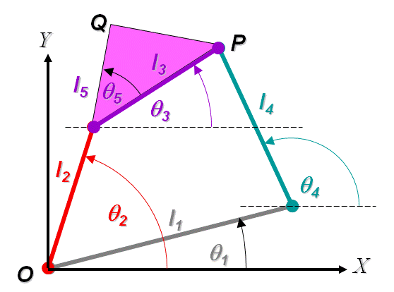

## Introduction
**Position Analysis of a 4 Bar RRRR Non Grashofian Double Rocker Mechanism**

Schematic Diagram of a 4 Bar RRRR Linkage

The 4 bar RRRR mechanism is forms the basis of any study on mechanism. It is widely used in various forms because of the relative simplicity of design and manufacture as well as durability. Grashof's criteria is used to distinguish between 4 bar RRRR linkages depending on the rotatability of the individual links of a 4 bar mechanism. In brief, if ***I*** is the longest link, s the longest link and the other two links have length ***p*** and ***q*** then the following cases arise

- l + s < p + q   :  Grashofian Linkage
  - l + s < p + q , shortest link s is the ground link  :   Double Crank
  - l + s < p + q , shortest link is the coupler :  Double Rocker
  - l + s < p + q , shortest link is neither coupler nor ground  :   Crank Rocker
- l + s > p + q   :   Non Grashofian Double Rocker
For a more detailed introduction to Grashof criteria see the animated guide that follows. You can either click on the animation itself to move from step to step as per your convenience. Alternatively you can use the controls at the bottom of the animation to see it at your own pace.

 
  <object width="900" height="700" data="./content/Grashof_RRRR/index.html"></object>
                            
 

In a Crank Rocker, unlike a Double Crank, only the input link (link 2, which is the crank) rotates through a full circle about the ground (link 1, which is the frame), while the output link (link4, which is the rocker) does not. The output link oscillates instead between two limiting positions. Thus the position analysis of a Crank Rocker involves, apart from finding out the coupler curve and the relation between the input and output orientations, finding the limiting posiitons of the link 4 and the corresponding positions of link2. Since the input link rotates through a full circle it is still possible to drive this mechanism using a simple continuous rotary drive, that is we may connect it directly to a simple motor. However we cannot connect the output to a continuous rotary drive directly since the output link moves back and forth.

## Demo
<table align="center">
                                <tr>
                                    <td>
                                        <object width="350" height="450" data="./content/demo/demoGR/demo_RRRR.html"></object>
                                    </td>
                                    <td>
                                        <object width="350" height="450" data="./content/demo/demoNG1/demo_RRRR.html"></object>
                                    </td>
                                </tr>
                                <tr>
                                    <td>
                                        <object width="350" height="450" data="./content/demo/demoNG2/demo_RRRR.html"></object>
                                    </td>
                                    <td>
                                        <object width="350" height="450" data="./content/demo/demoNG3/demo_RRRR.html"></object>
                                    </td>
                                </tr>
                            </table> 

**Animations of a Grashofian and 3 types of Non Grashofian Double Rockers**

- Clicking on the ***buttons*** will rotate the crank in the directions indicated (CW=clockwise, CCW=counterclockwise). The ***slider*** can be used for controlled rotation.
- The view can be rotated about a point by keeping the ***left mouse button*** pressed and rotating the mouse.
- The view can be translated by keeping the ***right mouse button*** pressed and translating the mouse in the desired direction
- The ***scroll button*** or ***middle mouse button*** can be used for zooming.
- The view can be rotated about the coordinate axes by using the ***left (<--)*** and ***right (-->)*** keys and the ***Page Up*** and ***Page Down*** keys on  the keyboard.
- Using the ***Up Arrow*** and ***Down Arrow*** keys will move the view towards or away from the viewer.
- The - and + ***(or Shift + =)*** keys may be used for zooming out and zooming in.
- Pressing the = key will get the view back to default.
